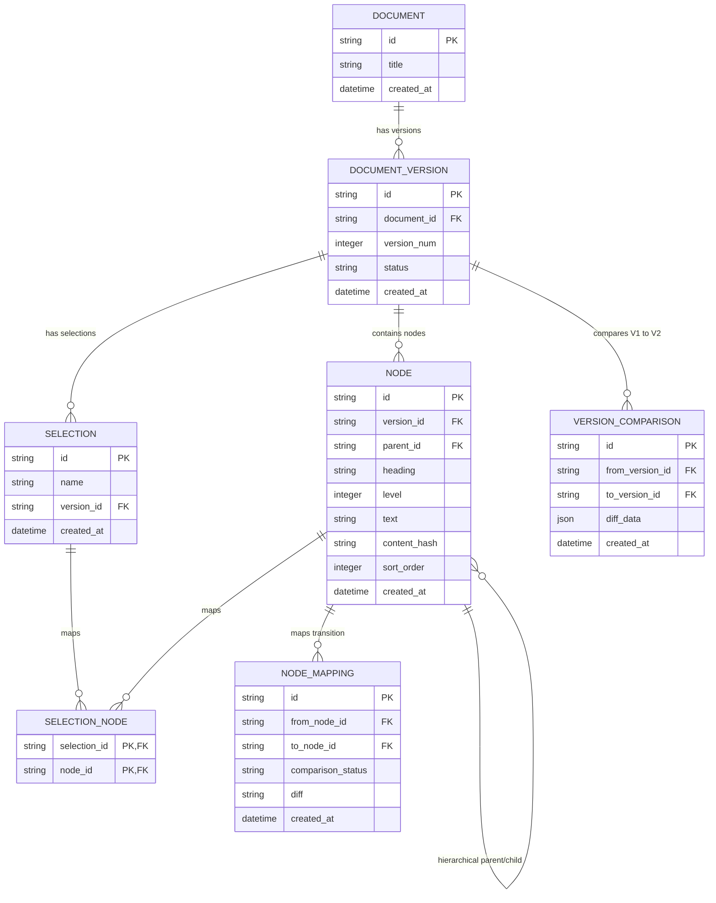
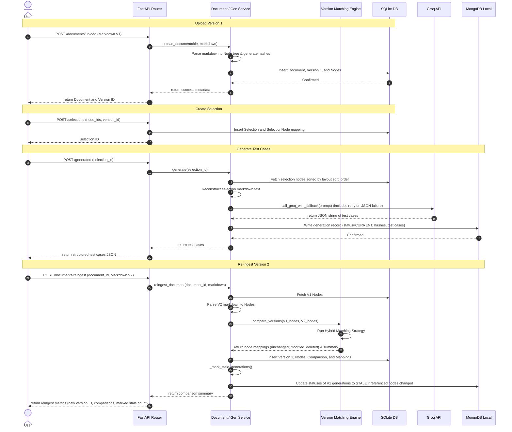

# Technical Approach Document

This document provides a detailed overview of the system architecture, design decisions, database models, algorithms, and prompt engineering strategies used to implement the blood pressure monitor technical manual parser and test generator.

---

## 1. System Architecture

The project is built using **Clean Architecture** and follows **SOLID** principles:

```
app/
├── api/             # Controllers: HTTP Route handlers and request/response validation
├── config/          # Configurations: Settings class mapping env variables
├── database/        # Data Access: SQLAlchemy engine, session maker, and MongoDB client
├── models/          # Relational Database Models (SQLAlchemy Declarative Base)
├── schemas/         # Pydantic v2 schemas for API serialization and LLM parsing
├── repositories/    # Data Access Layer: SQLite repositories and MongoDB repositories
├── services/        # Business Logic Layer: Ingestion, matching, selection, and generation services
├── parser/          # Markdown parsing logic
├── versioning/      # Hybrid matching and diff generation engine
└── main.py          # Application entrypoint
```

### Architectural Patterns
- **Repository Pattern**: Separates database access code from business logic. SQLite uses `DocumentRepository` wrapping SQLAlchemy, while MongoDB uses `GenerationRepository` wrapping the Motor driver.
- **Service Layer**: Implements core business workflows. `DocumentService` handles ingest and comparison. `GenerationService` coordinates selection text reconstruction, Groq LLM calls, and staleness calculations.
- **Dependency Injection**: Wires up db sessions into API routes (`Depends(get_db)`) to ensure testability and clean lifecycle management.

---

## 2. Entity-Relationship (ER) Diagram

The SQLite database stores metadata, document hierarchy, selections, and lineages. MongoDB stores the raw and parsed LLM outputs.



---

## 3. Workflow Diagram

The ingestion, generation, re-ingestion, and staleness check workflows are coordinated as follows:



---

## 4. Parser Design

The markdown parser splits the document line-by-line while maintaining a **heading parent stack** to preserve nesting relations:
1. **Heading Detection**: A regular expression `^(#{1,6})(?:\s+(.*)|$)` matches level 1–6 headings.
2. **Heading Cleansing**: Leading number prefixes (like `1.`, `2.1.1`) and markdown syntax (such as bold asterisks `**`) are stripped out for comparison stability, while raw titles are preserved in SQLite.
3. **Hierarchy Stack Management**:
   - When a heading of level $L$ is encountered, the parser pops headings off the parent stack until the top heading's level is less than $L$.
   - The node at the top of the stack becomes the new heading's `parent_id`.
   - The new heading node is then pushed onto the stack.
4. **Paragraph Preservation**:
   - Content following a heading is accumulated in that node's `text_lines` until another heading is matched.
   - All formatting, such as tables, bullet lists, and code blocks, is fully preserved without alterations.
5. **Edge Cases**:
   - **Duplicate Headings**: Supported since each node is assigned a distinct UUID.
   - **Empty Headings** (e.g., `##### `): Parsed as level 5 headings with `heading=""`.
   - **Intro Text**: Any paragraph found before the first heading is appended to a virtual `Intro` node.
6. **Determinism**:
   - Node hash is computed as `SHA256(heading + "\n" + text)`.
   - A sequential `sort_order` integer is stored with each node to guarantee that text can be reconstructed in the exact document order.

---

## 5. Hybrid Version Matching Strategy

When comparing two document versions, the engine employs a **multi-stage matching system** to link V1 nodes to V2 nodes:
1. **Exact Path & Hash Match**: If a node in V2 has the exact same normalized path (e.g. `/device overview/intended use`) and content hash as a node in V1, they are matched as `UNCHANGED`.
2. **Exact Path Match (Content Modified)**: If a node in V2 has the same path as a node in V1 but a different content hash, they are matched as `MODIFIED`. A unified diff is computed for the text block.
3. **Content Hash Match**: If the path changed (e.g., section moved, hierarchy level changed) but the content hash is identical, the nodes are paired as `UNCHANGED`.
4. **Fallback Title Similarity Match**: If a node remains unmatched, the engine calculates the similarity ratio (using `difflib.SequenceMatcher`) between its normalized heading and all unmatched V1 nodes. If the similarity is $\ge 80\%$:
   - Paired as `UNCHANGED` (if hashes match) or `MODIFIED` (if hashes differ, with unified diff).
5. **Lineage Mappings**:
   - Unmatched V2 nodes are categorized as `ADDED`.
   - Unmatched V1 nodes are stored as `DELETED` in the SQLite `node_mappings` table.

### Limitations of this Strategy
- **Flattened Trees**: If a document flattens its hierarchy (as in `ct200_manual_v2.md` where everything becomes level 2), the exact path matching fails. The engine falls back to hash matching and title similarity, which successfully pairs the nodes but loses the hierarchical context.
- **Large Sections Split/Merged**: If a section is split into two, or multiple sections are merged, the title and hash will change, causing the matcher to detect them as a deletion of old nodes and additions of new ones rather than modified nodes.

---

## 6. Staleness Detection Mechanics

The staleness checker guarantees that old test case generations do not drift silently:
1. **Upload Propagation**: Upon uploading a new version (V2), the server finds all generations linked to the previous version (V1). For each generation, it inspects the referenced nodes in `node_hashes`. If any of these node IDs were marked as `modified` or `deleted` in the comparison mappings, the generation's status is set to `STALE` in MongoDB, with a `stale_reason` listing the changed headings.
2. **On-Retrieval Computation**: When fetching generations via `GET /generated/{selection_id}`, the server performs a live check. It compares the saved `node_hashes` from the generation payload with the current content hashes of those nodes in SQLite. This catches any manual database edits, data drift, or direct updates.
3. **Diff Summarization**: The retrieval API returns the previous hash, current hash, list of changed headings, and a text diff summary of the modifications.

---

## 7. Prompt Engineering & Failure Handling

### LLM Prompt Design
The Groq prompt sets up strict instructions for the LLM:
- **Role**: Expert QA Engineer.
- **Rules**: Return ONLY valid JSON matching the Pydantic schema structure. No markdown formatting, no text before or after.
- **Test Case Fields**: unique ID, title, requirement reference, preconditions, steps array, expected result, priority, risk level, and category.

### Failure Handling & Fallbacks
1. **Model Fallback Chain**: Wires up an automatic fallback sequence: `llama-3.3-70b-versatile` $\rightarrow$ `llama3-70b-8192` $\rightarrow$ `llama3-8b-8192` $\rightarrow$ `mixtral-8x7b-32768`. If the primary model fails or is rate-limited, it automatically falls back.
2. **Single Parsing Retry**: If the response is not valid JSON or fails Pydantic schema validation, the client captures the error, appends it to the prompt as feedback, and sends a single retry command.
3. **Raw Response Storage**: If the retry still fails, the system inserts the failed run into MongoDB with `status="FAILED"`, saving the raw text and exception logs for developer review, and raises a `502 Bad Gateway` API error.

---

## 8. Decision Log

### 1. Which part of the system is most likely to silently fail?
The **markdown parser** when encountering highly irregular or malformed tables and custom list syntax. Since the parser is designed not to lose content, it preserves structural anomalies inside the node's body text block. However, if headers are not formatted with standard `#` symbols, they may be treated as normal paragraphs and get grouped under the wrong node, leading to incorrect test case references during LLM generation.

### 2. What trade-off did you make because of time?
Because of time, version comparison is performed sequentially between version $N$ and $N+1$, rather than building a full transitive DAG matching lineage between all historical versions. This means that if a selection is pinned to Version 1, and the user uploads Version 2 then Version 3, the lineage is checked step-by-step or dynamically by lookup, which is efficient but does not support visualization of tree differences across non-sequential versions.

### 3. Which inputs are intentionally unsupported?
- **Embedded Images/Binary Attachments**: The parser only ingests UTF-8 encoded text. Images and binary elements are ignored.
- **HTML Tags inside Markdown**: Inline HTML is parsed as plain text and is not interpreted or stripped by the parser.
- **Non-Standard Heading Formats**: Setext headings (using underlining `=` or `-`) are not supported; headings must use at least one `#` mark.
